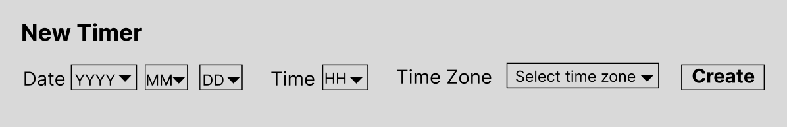
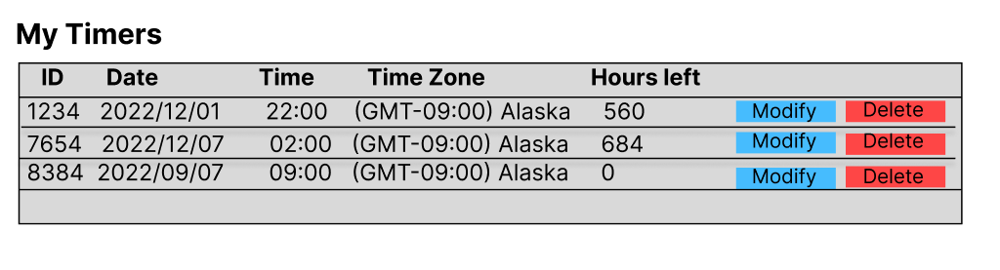

# Using Syncro-Timer

Syncro-Timer is an hourly countdown timer that helps you set and modify important event times across your applications.

When you create a timer for a new event, Syncro-Timer generates a unique ID that developers can use with the customer.io API. 
[See the API reference](../api/README.md).

## How Syncro-Timer works

Syncro-Timer counts down in hour increments and produces an alert at each hour via the API. 

Because alerts are triggered at the beginning of each full hour, timers always round up. 
For example, if your event is 3pm today and it's 12:15 pm now, your timer will show three hours left. 
At 1pm, it updates to show two hours left, and so on. 

When a timer reaches zero hours left, it stops, but stays in the system until you delete or reset it. 

If your schedule changes, you can modify an existing timer. Modifications are immediately reflected in any application or website 
that uses the timer's ID.

## Adding a timer

1. From your dashboard, click the **Syncro-Timer** tab. 
2. Click **New Timer**.

3. On the **New Timer** dialog, use the drop-downs to set the date, time, and [time zone](https://customer.io/docs/example-timezones/#detailed). 
4. Click **Create**.

The new timer is added to the top of the **My Timers** table. Use the 4-digit **ID** to integrate the timer into your applications via the API.

## Managing timers

You can view your existing timers on the **Syncro-Timer** tab. 

To modify an existing timer, click the **Modify** button in its table row. 
A **Edit Timer** dialog opens. Here, you can change the same fields you set during the [timer creation](#adding-a-timer) workflow. 

To delete a timer, click the **Delete** button in its table row. 

> **CAUTION**: You can't recover a timer's ID after deleting it. Any website or application using the timer ID via the API will return an error. Make sure the timer isn't being used anywhere before you delete it.
